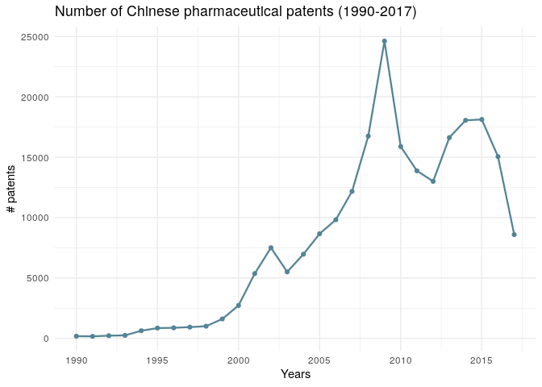

<!-- README.md is generated from README.Rmd. Please edit that file -->

# Innovation in the Pharmaceutical Industry in China: A Jaccard Similarity Perspective

<!-- badges: start -->

<!-- badges: end -->

## Overview

The dataset is about innovation dynamics in the pharmaceutical industry
in China. Innovation dynamics is interpreted as knowledge transfer
across technologies and through time (velocity). The dataset provides
access to 143,916 Jaccard similarity indices. They proxy relatedness
across technologies (classes) and through time (velocity). They are the
result of a Natural Language Processing treatment of 69,923 patents in
the pharmaceutical industry in China from 1990 to 2017.

### Value of the Data

  - The Jaccard similarity indices computed in this dataset allow us to
    map patents’ relatedness in the Chinese pharmaceutical industry. The
    Jaccard similarity provides a cross-section relatedness and
    longitudinal cartography.

  - Researchers can benefit from these data to capture the actual
    dynamics of innovation, with a particular interest in knowledge
    creation and relatedness in China’s pharmaceutical industry. The
    data can also benefit policymakers and firms for the same reason.

  - Researchers in innovation can use the similarity indices as either a
    feature or a target variable in their models. As a feature variable,
    the similarity indices can help describe the success of some public
    policies, firms, or innovation ecosystems. As a target variable,
    they may help find the source of innovation dynamics in the Chinese
    pharmaceutical industry.

## Functionality

### Description of the dataset variables

|    Variable name    |                                                 Description                                                  |
| :-----------------: | :----------------------------------------------------------------------------------------------------------: |
|       name\_i       |        Corresponds to class\_i + year\_i containing all patents of this group and year in the dataset        |
|      class\_i       |                                    Manual code section for patent group i                                    |
|       year\_i       |                                            Year of patent filing                                             |
|       vol\_i        |                                   Number of patents in the group (name\_i)                                   |
|       name\_j       |        Corresponds to class\_j + year\_j containing all patents of this group and year in the dataset        |
|      class\_j       |                                    Manual code section for patent group j                                    |
|       year\_j       |                                      Year of patent filing for group j                                       |
|       vol\_j        |                                   Number of patents in the group (name\_j)                                   |
|     year\_diff      |                     The difference in years between year\_i and year\_j of patent filing                     |
|      vol\_diff      | Difference in the amount of patents filed in each class for a respective year (difference vol\_i and vol\_j) |
| Jaccard\_Similarity |               Similarity between patent class i and patent class j and their respective years                |

### Description of the top 20 manual code sections (1990-2017)

| Manual code sections |                              Category                              |                         Sub-category                          |
| :------------------: | :----------------------------------------------------------------: | :-----------------------------------------------------------: |
|        B14-N         |                     Pharmaceutical activities                      |                            Organs                             |
|        D05-H         |                       Fermentation industry                        |              Microbiology, laboratory procedures              |
|        B04-A         |       Natural products (or genetically engineered), polymers       |                   Alkaloids, plant extracts                   |
|        B14-S         |                     Pharmaceutical activities                      |                 Miscellaneous activity terms                  |
|        B14-F         |                     Pharmaceutical activities                      |      Drugs acting on the blood and cardiovascular system      |
|        B04-C         |       Natural products (or genetically engineered), polymers       |                           Polymers                            |
|        B14-C         |                     Pharmaceutical activities                      | Anaesthetics and drugs relieving fever, inflammation and pain |
|        B04-E         |       Natural products (or genetically engineered), polymers       |                         Nucleic acids                         |
|        B12-M         |                 Diagnostics and formulation types                  |                       Formulations type                       |
|        B14-J         |                     Pharmaceutical activities                      |       Drugs acting on the muscular and nervous systems        |
|        B14-H         |                     Pharmaceutical activities                      |                     Cancer related drugs                      |
|        B11-C         |                         Process, apparatus                         |                  General process, apparatus                   |
|        B14-A         |                     Pharmaceutical activities                      |                         Antimicobials                         |
|        B14-E         |                     Pharmaceutical activities                      |          Drugs acting on the gastrointestinal system          |
|        B10-A         | Aromatics and cycloaliphatics (mono and bicyclic only), aliphatics |                 Rarer chemical groups general                 |
|        B14-G         |                     Pharmaceutical activities                      |               Drugs acting on the immune system               |
|        B14-D         |                     Pharmaceutical activities                      |           Hormonal, antihormonal, enzyme inhibitors           |
|        A12-V         |                        Polymer applications                        |           Medical, dental, cosmetics and veterinary           |
|        B07-D         |                     Heterocyclics, mononuclear                     |                    Sole hetero(s) nitrogen                    |
|        B06-D         |                      Heterocyclic fused ring                       |                    Sole hetero(s) nitrogen                    |

## Installation

Option 1. You can install ipcR from [GitHub](https://github.com/) with:

``` r
# install.packages("devtools")
devtools::install_github("warint/innovation_pharma_china")
```

Option 2. You can also download the data (csv format)
[here](https://warin.ca/datalake/innovation_pharma_china/innovation_pharma_china.csv)

## How-To

### Step 1: Getting the data

``` r
myData <- ipcr_data()
```

### Step 2: Creating visuals

The ipcr\_visual() function allows you to create three types of visual :
line, point and box charts.

``` r
ipcr_visual(chart = "line_1")
```



``` r
ipcr_visual(chart = "line_2",class = "a12v")
```


## Cite

Warin, Thierry, and C. Vorreuther. 2020. “Patent Relatedness and
Velocity in the Chinese Pharmaceutical Industry: A Dataset of Jaccard
Similarity Indices”,forthcoming.

### Acknowledgments

The author would like to thank the Center for Interuniversity Research
and Analysis of Organizations (CIRANO, Montreal) and the Professorship
in Data Science for International Business (HEC Montréal, Canada) for
their support, as well as Thibault Senegas, Marine Leroi and Martin
Paquette. The usual caveats apply
